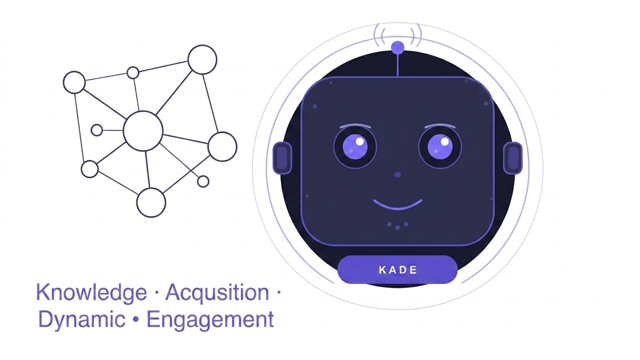

# KADE



> A communications desk that sits politely behind your community, ready to help.

KADE is a Telegram assistant that reads the room before it speaks. It manages your groups, learns from your knowledge sources, and replies like a thoughtful teammate. Set it up in an afternoon. Refine it forever.

---

## What KADE does

**Conversations, not just commands**
KADE reads context, replies like a thoughtful teammate, and knows when to stay quiet.

**Cites its sources**
Point it at your knowledge sources — blog URLs, house rules, tone of voice guidelines. It reads them and cites them when it answers.

**Full group moderation**
Add, remove, mute, warn, pin, schedule. Set rules once, enforce them everywhere.

**Multi-group, one workspace**
Run multiple bots from a single dashboard. Assign different rules and knowledge sources per bot or per group.

**Live oversight**
Watch replies in real time. Pause, edit, take over, hand back. Full audit trail included.

---

## Getting started

**1. Create your bot in Telegram**
Head to [@BotFather](https://t.me/BotFather) and create a new bot. Copy your bot token.

**2. Train it on your knowledge**
Drop in blog URLs, write house rules, and define your tone of voice from the dashboard.

**3. Invite KADE to your group**
Invite KADE to your Telegram group. Promote it to admin if you want moderation powers.

**4. Monitor and step in anytime**
See every message and reply in your dashboard. Pause or take over at any point.

Start in seconds. No card required.

---

## The dashboard

- Live log of every message KADE sees and sends, newest first
- Pause, edit, or take over any reply
- Manage all your bots and groups in one workspace
- Add knowledge sources — URLs, pasted text, or house rules
- Full audit trail on every action

---

## Bot persona

You can customise KADE's personality per bot. Example:

```
You are KADE for [Your Community]. Be warm, concise, and cite sources when you can.
```

---

## Pricing

Simple plans. Grow when you're ready.

| Plan | Best for |
|---|---|
| Free | Try KADE on a single small group |
| Starter | One community manager |
| Pro | Active multi-group communities |
| Agency | Agencies and large workspaces |

---

## Tech stack

| Layer | Technology |
|---|---|
| Telegram interface | python-telegram-bot / Telethon |
| AI | OpenAI GPT-4o API |
| Web scraping | BeautifulSoup + Scrapy |
| Memory & context | Pinecone / ChromaDB |
| Backend | Python + FastAPI |
| Auth & database | Supabase |
| Frontend | React + Tailwind CSS |
| Hosting | Vercel |
| Payments | Stripe |

---

## Security

- Your OpenAI API key is stored server-side — only you can read it
- Supabase-powered auth with secure session management
- WebAuthn / passkey support for dashboard login
- Full audit trail on all bot actions

---

## License

MIT — free to use, fork, and build on.

---

Your community deserves a calm, well-read desk clerk. [Try KADE free →](https://kade-ai.vercel.app)
